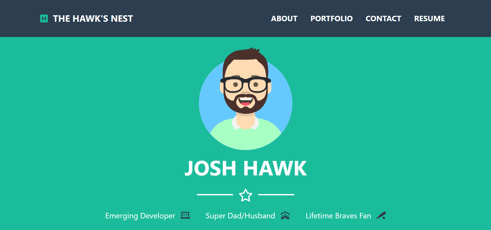

# module20-react-portfolio-challenge

## Description

In this challenge, I created a portfolio web app using React to introduce myself and showcase the different projects I have designed and created during this bootcamp.

## Screenshot

## Link

To view the deployed web app, [CLICK HERE](https://hawkjosh.github.io/).